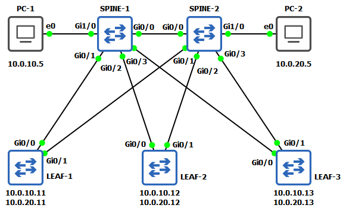

# LABO 02-01 Spanning tree configureren

Dit labo is een basis opstelling voor het leren opzetten en troubleshooten van Spanning tree

Er worden 2 pcs voorzien als "server". Elk van de leaf switches wordt voorzien van een svi in elk vlan.

## Opstelling

Je kan alle startup configuraties vinden in de `startup-config` map. Een voorgeconfigureerd GNS3 labo kan je vinden in de `gns3` map.

## Devices

* 5 x IOSvL2
* 2 x VPCS

## Verificatie

Als de basis opstelling correct uitgevoerd is moeten alle leaf switches beide pc's kunnen pingen.