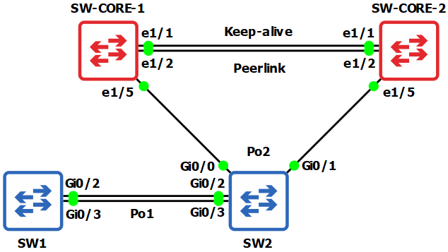

# LABO 04-01 Layer 2 redundancy configureren

> Let op: Uitzonderlijk is het gns3 labo niet voorgeconfigureerd. De reden hiervoor is dat de Nexus switch zelf een installatie doet en dit zou het labo meerdere gigabyte groot maken. Start gewoon het toestel op en plak de startup config.

Dit labo is een basis opstelling voor het leren opzetten en troubleshooten van Layer 2 redundancy

Er zijn 2 nexus 9000 switches en 2 normale layer 2 switches.

## Opstelling


Je kan alle startup configuraties vinden in de `startup-config` map. Een voorgeconfigureerd GNS3 labo kan je vinden in de `gns3` map.

We maken gebruik van 3 vlans:

```
vlan 10
name dc-west
vlan 20
name dc-east
vlan 99
name native-vlan
```

## Devices

* 2 x NX-OSv 9000
* 2 x IOSvL2

# Nexus switch features

Standaard staan niet alle config opties ingeschakeld op een Nexus switch. Dit moet je enablen met het feature commando. Je dient de volgende features in te schakelen:

```
feature interface-vlan
feature lacp
feature vpc
```

# Default login voor Nexus switches

De default login is `admin` met een leeg wachtwoord wanneer je van 0 begint, of `admin` met wachtwoord `Admin.Cisco` voor een bestaand labo.

# Een Nexus switch voor de eerste keer booten

Wanneer je voor de eerste keer een Nexus switch start dan moet je *lang* wachten. Dit is normaal. Op een bepaald moment zie je gewoon een leeg scherm met enkel een cursor. Dit is normaal en duurt makkelijk 5-10 minuten. Je moet hier gewoon wachten tot de switch vanzelf verder gaat.

> **Tip**: Dit is de ideale moment om te genieten van een tasje thee.

# Issues wanneer je een Nexus switch voor de eerste keer gebruikt

Mogelijks krijg je een issue wanneer je een Nexus switch voor de eerste keer boot. De reden hiervoor is dat je de eerste keer de autoconfig dient te skippen. Kies dus voor **`skip`**.

```
Abort Power On Auto Provisioning [yes - continue with normal setup, skip - bypass password and basic configuration, no - continue with Power On Auto Provisioning] (yes/skip/no)[no]: skip

!!! NOTE: You have selected skip option. POAP will be aborted and password configuration will be skipped !!!

```

Als je dit niet snel genoeg doet dan kom je op een loader prompt terecht:

```
...
No autoboot or failed autoboot. falling to loader
                Loader Version 5.9.2

loader >
```

Je moet dan enkel aangeven dat je wil manueel booten. Hiervoor vraag je met het `dir` commando eerst alle files op. Zoek dan naar de `.bin` file en boot deze met het `boot` commando:

```
loader > dir

bootflash::

  .rpmstore
  nxos64.10.1.1.bin
  bootflash_sync_list
  evt_log_snapshot
  .swtam
  eem_snapshots
  virtual-instance
  scripts
  20220811_113347_poap_24723_init.log
  poap_retry_debugs.log
  20220811_113347_poap_24723_1.log

loader > boot nxos64.10.1.1.bin
```


# Je admin gebruiker voorzien van een wachtwoord

Wanneer je boot kan je aanmelden met de `admin` user zonder wachtwoord. Maar je kan niet echt dingen configureren tot deze gebruiker voorzien is van een wachtwoord.

```
! Meld je aan met admin met een leeg wachtwoord

configure terminal
username admin password Admin.Cisco
do copy run start
```

Vanaf nu kan je alles naar hartelust configureren.