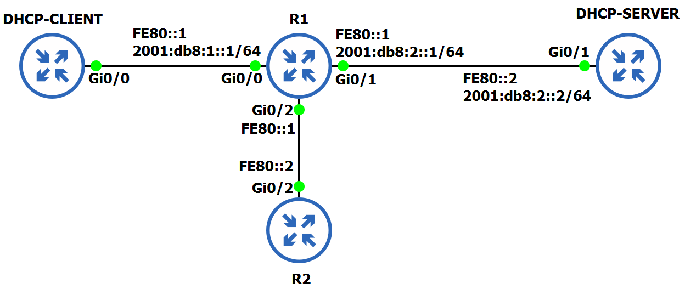

# Setup

## Opstelling

## Interfaces

| Device      | Interface | Address                  | Type       |
|-------------|-----------|--------------------------|------------|
| R1          | `G0/0`      | `FE80::1`              | link-local |
|             | `G0/0`      | `2001:db8:1::1/64`     | GUA        |
|             | `G0/1`      | `FE80::1`              | link-local |
|             | `G0/1`      | `2001:db8:2::1/64`     | GUA        |
|             | `G0/2`      | `FE80::1`              | link-local |
| R2          | `G0/2`      | `FE80::2`              | link-local |
| DHCP-SERVER | `G0/1`      | `FE80::2`              | link-local |
|             | `G0/1`      | `2001:db8:2::2/64`     | GUA        |
