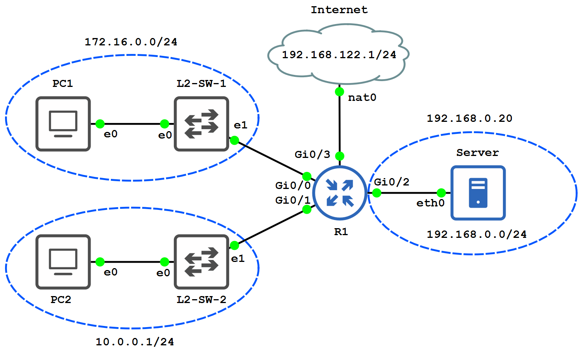

# Setup

## Opstelling

## Interfaces

| Device | Interface | Address            |
| ------ | --------- | ------------------ |
| R1     | `Gi0/0`   | `172.16.0.1/24`    |
|        | `Gi0/1`   | `10.0.0.1/24`      |
|        | `Gi0/2`   | `192.168.0.1/24`   |
|        | `Gi0/3`   | `192.168.122.2/24` |
| PC-1   | `e0`      | `172.16.0.10/24`   |
| PC-2   | `e0`      | `10.0.0.50/24`     |
| SERVER | `eth0`    | `192.168.0.20/24`  |